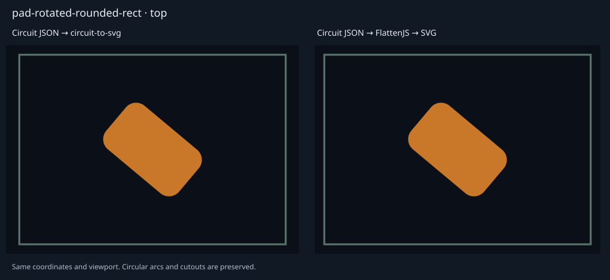
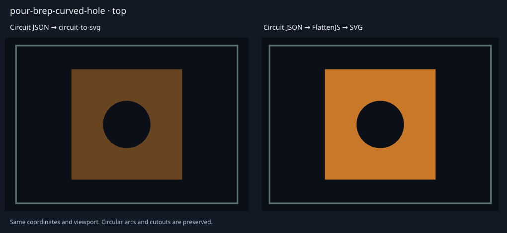
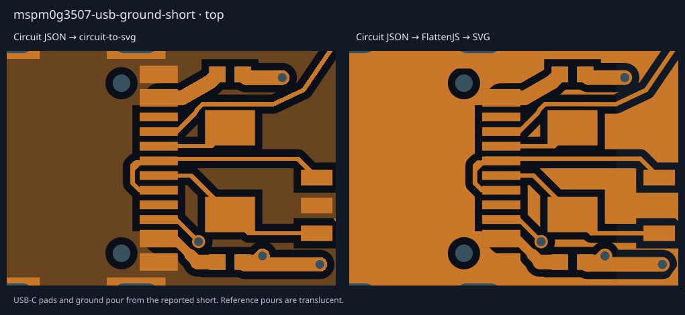

# circuit-json-to-flattenjs

Convert Circuit JSON PCB geometry into [FlattenJS](https://github.com/alexbol99/flatten-js) polygons for containment, intersection, distance, and design-rule checks. Circular edges stay circular; drill holes and copper-pour cutouts stay holes. Each result retains its source element and physical layer.

[**Browse the side-by-side visual snapshots**](docs/visual-snapshots.md) — circuit-to-svg on the left, FlattenJS → SVG on the right.




## Usage

Releases are published to GitHub Packages using the `tscircuit/plop` workflow and served through `jscdn.tscircuit.com`:

```sh
bun add https://jscdn.tscircuit.com/@tscircuit/circuit-json-to-flattenjs/latest.tgz
```

Pin a numbered version (`/<version>.tgz`) for reproducible installations. To work from this repository, run `bun install` and `bun run build`.

```ts
import { Point } from "@flatten-js/core"
import {
  convertCircuitJsonToFlattenJs,
  renderFlattenJsToSvg,
} from "@tscircuit/circuit-json-to-flattenjs"

const result = convertCircuitJsonToFlattenJs(circuitJson, {
  layers: ["top", "inner1"],
  roles: ["copper"],
  strict: true,
})

for (const element of result.elements) {
  console.log(element.elementId, element.layer, element.bounds)
  console.log(element.sourceElement) // Includes net/port/trace/component IDs
  const containsOrigin = element.shapes.some(shape =>
    shape.contains(new Point(0, 0)),
  )
}

const svg = renderFlattenJsToSvg(result, { width: 900, height: 600 })
```

The input is parsed Circuit JSON: millimetres, absolute board coordinates, rotations in degrees counterclockwise. Coordinates are never mirrored for bottom layers. SMT polygons are already absolute; plated-hole `pad_outline` points are local and receive the hole's `ccw_rotation`, or the owning component's rotation when the hole has none.

```ts
import { convertCircuitJsonElementToFlattenJs } from "@tscircuit/circuit-json-to-flattenjs"

const result = convertCircuitJsonElementToFlattenJs(pad, {
  circuitJson, // Supplies stackup and owning-component context
  layer: "top",
})
```

## Returned geometry

`{ elements, warnings, bounds, copperLayers }`

Each entry contains `elementId`, `elementType`, `sourceElement`, `role`, `layer`, `shapes`, and `bounds`. `shapes` is an array of real `Flatten.Polygon` instances, including circular `Flatten.Arc` edges and oppositely wound hole faces. One source element can produce multiple entries, one per selected layer. A trace can contain several shapes; they represent a **union** and can overlap. Summing their areas is not a union-area calculation.

Geometry is converted per source element. Separate board cutouts, drills, and other objects are returned with their own roles; they are not globally subtracted from every unrelated object. Embedded trace-via drills are subtracted from that trace's adjoining segments. Board outlines are envelopes, with board cutouts returned separately. This preserves element ownership for DRC callers.

`bounds` is a FlattenJS `Box`, or `undefined` for an empty result. Unsupported non-geometric records (source, schematic, CAD, labels, and so on) are ignored. Invalid supported geometry returns a warning containing its element ID; `strict: true` throws instead. Always inspect warnings in DRC applications.

## Selection and options

| Option | Behavior |
| --- | --- |
| `layer` / `layers` | One copper layer or a list. Mutually exclusive. Omit for all layers; `layers: []` selects no layered geometry. |
| `copperLayers` | Explicit physical stack order, e.g. `["top", "inner1", "inner2", "bottom"]`. Inferred from board `num_layers` and observed inner layers otherwise; a context-free circuit defaults to two layers. |
| `elementTypes`, `elementIds`, `roles` | Optional filters, combined with layer selection. |
| `includeLayerless` | Include board outlines, cutouts, and non-plated holes even with a layer filter. Default `true`. |
| `includeDrillHoles` | Default `true`. Set `false` for via/plated-pad outer copper envelopes. Pour cutouts are always preserved. |
| `curveTolerance` | Maximum ellipse chord error in mm, default `0.001`. FlattenJS has no native ellipse. Circular arcs are always exact. |
| `strict` | Default `false`; throw instead of collecting geometry warnings. |

Vias and plated holes span the stack between their outermost listed layers. A top-to-bottom via therefore appears on intervening inner layers, while a top-to-inner1 blind via does not appear on the bottom. Keepout layer lists are used exactly as specified.

## Coverage

| Circuit JSON type | Geometry |
| --- | --- |
| `pcb_smtpad` | Circle, rectangle, rounded rectangle, rotated rectangle, pill, rotated pill, polygon; concave and repeated/closed polygon vertices. |
| `pcb_plated_hole` | Circle, ellipse/oval, pill, circular or pill drill in rectangular pad, independently rotated pad and drill, polygonal pad; drill offsets and component-local rotation. |
| `pcb_hole` | Circle, legacy square, rectangle, ellipse/oval, pill, rotated pill. |
| `pcb_via` | Annular copper and selected physical layers. |
| `pcb_trace` | Round-ended constant-width segments, variable widths per segment, flat-ended interpolated traces with bends, `through_pad`, inline vias and layer transitions. Inline vias need explicit diameters; legacy `via_diameter` / `via_hole_diameter` are also accepted. |
| `pcb_copper_pour` | Rotated rectangle, polygon, BRep outer ring plus multiple inner rings; positive/negative bulges, clockwise rings, two-arc circles. |
| `pcb_board` | Rectangular or polygonal outline. |
| `pcb_cutout` | Circle, rounded/rotated rectangle, polygon, continuous round-ended path slot. |
| `pcb_keepout` | Rectangle, circle, filled outline. |
| `pcb_courtyard_*` | Rectangle, circle, pill, polygon, closed outline. |

Patterned path cutouts (`slot_length`, `space_between_slots`) and custom path corner radii currently return explicit warnings; use individual rectangular/polygonal cutouts for these. Text, silkscreen, soldermask/paste expansion, and simulation/schematic geometry are outside this package's PCB collision-geometry scope. Conversion does not generate thermal spokes or clipping that is absent from Circuit JSON.

## Visual and numeric regression tests

```sh
bun install --frozen-lockfile
bun test
bun run typecheck
bun run format:check
bun run build

# Deliberately regenerate SVG baselines after reviewing a geometry change:
UPDATE_SNAPSHOTS=1 bun test tests/visual.test.ts
bun run gallery
```

Snapshots use the same physical viewport and scale on both sides. SVG coordinates are serialized to eight decimal places for cross-platform stability; in-memory geometry retains full precision. The left is independently rendered from the input by the pinned `circuit-to-svg`; the right is rendered exclusively from FlattenJS polygons. Tests compare 73 committed SVGs, verify analytic areas and containment, validate polygon topology, and exercise filters and warnings. Another 39 tests compare actual copper silhouettes between the two renderers, allowing only a one-pixel antialiasing neighborhood at edges. The original MSPM0G3507 board is covered on top and bottom, with a close-up of the USB-C ground-pour short.

Some reference-renderer differences are intentionally visible and labeled: polygon-pad rotation, blind-via layer filtering, inline-via diameter inference, missing outline keepouts/pill courtyards, and path-slot rendering. These cases have independent geometry tests; a visual snapshot alone is not treated as proof that both renderers agree. Pour opacity and keepout hatching are styling differences.


